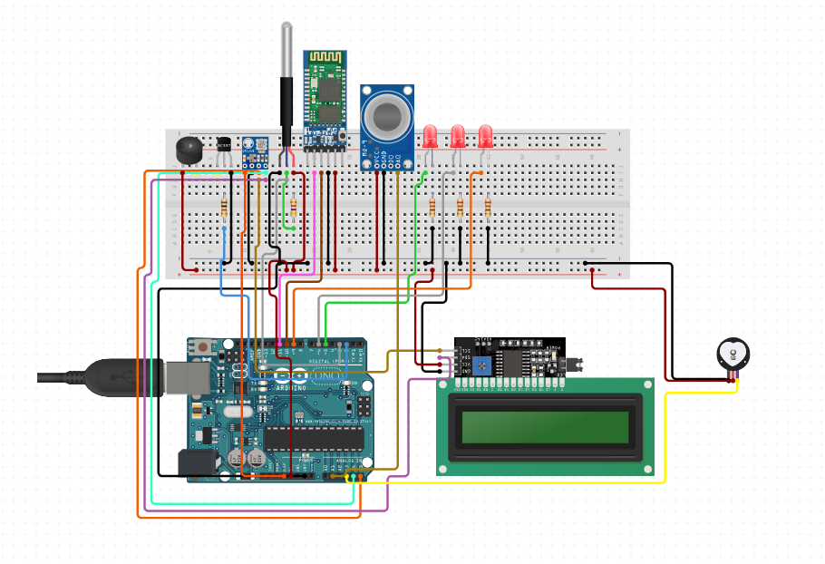
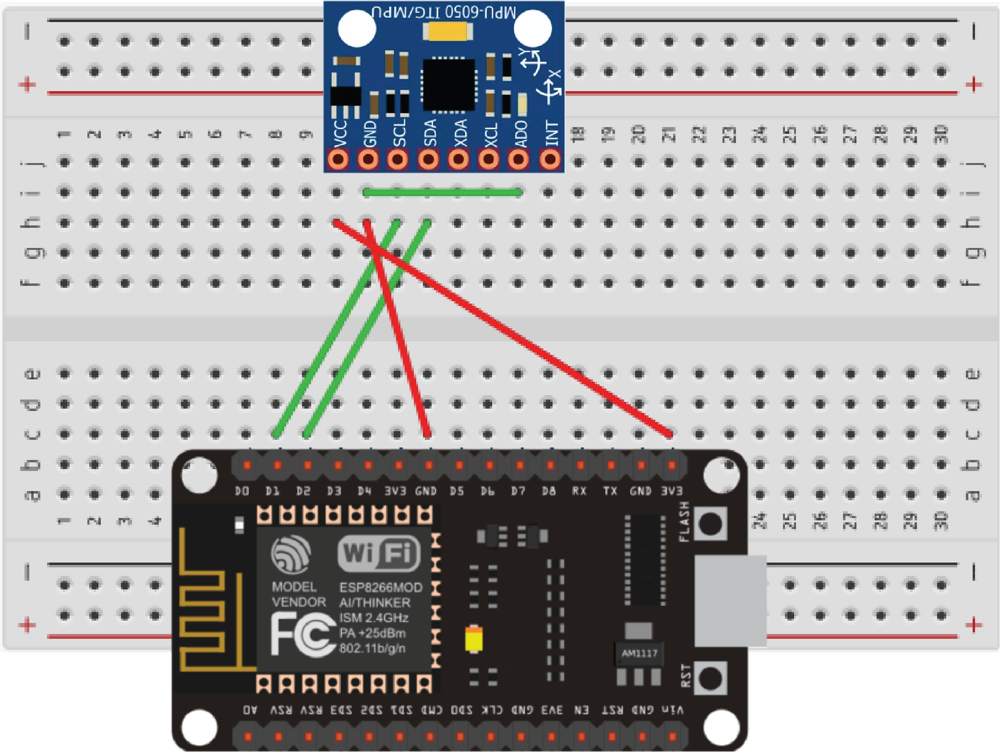

# Patient Monitoring System

## Description
This project is designed to measure the bpm, temp, pressure and co2 of a patient. It also detects if the patients falls from the bed.

---

## Diagrams

### 1. PMS

### 2. Fall Detector

---

## Project Images

### Image 1

### Image 2

